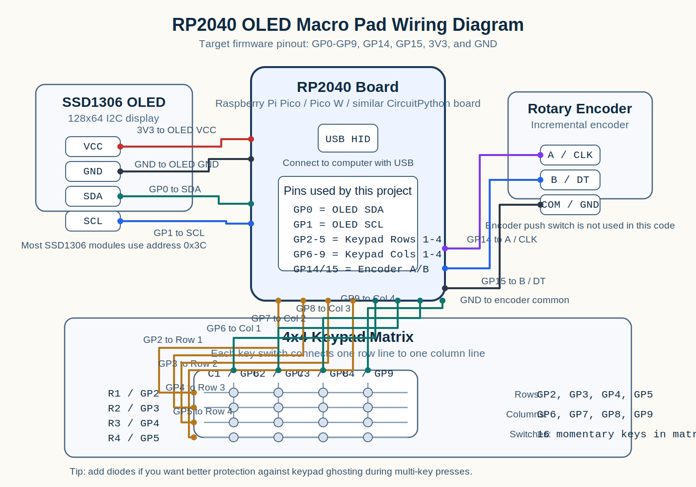

# RP2040 OLED Macro Pad

A 16-key USB macro pad built with CircuitPython, a 128x64 SSD1306 OLED, and a rotary encoder. The project is designed around an RP2040 board such as the Raspberry Pi Pico or Pico W and is tuned for macOS shortcuts, media controls, and desktop navigation.

## Features

- 4x4 matrix keypad for 16 dedicated macro keys
- Rotary encoder with two operating modes:
  - volume control
  - scroll up/down
- OLED status screen with:
  - current volume percentage
  - progress bar
  - last action label
- Automatic OLED sleep after 30 seconds of inactivity
- Wake-on-input behavior
- USB HID keyboard shortcuts and consumer control media commands
- App switcher key that holds `Cmd` until the button is released

## Demo Behavior

When the macro pad is powered and connected over USB:

- rotating the encoder in `Volume` mode sends media volume up/down commands
- rotating the encoder in `Scroll` mode holds the arrow key briefly for smooth scrolling
- pressing a macro key sends the assigned keyboard shortcut or media command
- the OLED updates to show the most recent action
- the display turns off after inactivity and wakes up on the next input

## Hardware Used

This project expects the following hardware:

- 1 x RP2040 board with native USB HID support
  - Raspberry Pi Pico
  - Raspberry Pi Pico W
  - similar CircuitPython-compatible RP2040 board
- 1 x 128x64 SSD1306 I2C OLED display
- 1 x rotary encoder
- 16 x momentary push buttons or keyswitches
- 1 x 4x4 matrix wiring layout for the keypad
- hookup wire
- breadboard, perfboard, or custom PCB
- USB cable for programming and power

## Pin Mapping

The code uses the following GPIO assignments:

| Function | Pin(s) |
| --- | --- |
| OLED SDA | `GP0` |
| OLED SCL | `GP1` |
| Keypad row 1 | `GP2` |
| Keypad row 2 | `GP3` |
| Keypad row 3 | `GP4` |
| Keypad row 4 | `GP5` |
| Keypad column 1 | `GP6` |
| Keypad column 2 | `GP7` |
| Keypad column 3 | `GP8` |
| Keypad column 4 | `GP9` |
| Rotary encoder A | `GP14` |
| Rotary encoder B | `GP15` |

Also connect:

- OLED `VCC` to `3V3` or board-compatible display power input
- OLED `GND` to `GND`
- keypad matrix switches according to the row/column layout above
- rotary encoder `GND` to `GND`

## Wiring Diagram



Quick wiring summary:

- OLED `SDA` -> `GP0`
- OLED `SCL` -> `GP1`
- OLED `VCC` -> `3V3`
- OLED `GND` -> `GND`
- Encoder `A/CLK` -> `GP14`
- Encoder `B/DT` -> `GP15`
- Encoder `COM/GND` -> `GND`
- Keypad rows `R1-R4` -> `GP2-GP5`
- Keypad columns `C1-C4` -> `GP6-GP9`

If your rotary encoder breakout also has a push-button pin such as `SW`, you can leave it unconnected with the current code because the encoder button is not used.

## Software Stack

### Firmware

- [CircuitPython](https://circuitpython.org/)

### Built-in CircuitPython modules used in the code

- `time`
- `board`
- `busio`
- `rotaryio`
- `usb_hid`
- `digitalio`

### External libraries required in `CIRCUITPY/lib`

Copy these from the matching Adafruit CircuitPython Library Bundle:

- `adafruit_hid/`
- `adafruit_ssd1306.mpy`
- `adafruit_bus_device/`
- `adafruit_framebuf.mpy`

## Libraries Used in Code

### `adafruit_ssd1306`

Used to drive the 128x64 OLED over I2C.

In this project it is responsible for:

- creating the display object
- drawing text
- drawing the volume bar
- refreshing the screen buffer

### `adafruit_hid.keyboard`

Used to send keyboard shortcuts such as:

- `Cmd + Q`
- `Cmd + C`
- `Cmd + V`
- `Cmd + Shift + 4`
- `Ctrl + Cmd + Q`

### `adafruit_hid.consumer_control`

Used for media and system control commands such as:

- volume up
- volume down
- mute
- play/pause
- next track
- previous track

### `rotaryio`

Used to read the rotary encoder position so the dial can work as:

- a volume knob
- a scroll wheel

## Installation

### 1. Install CircuitPython on the board

Install a current CircuitPython release for your RP2040 board, then reconnect it so it appears as the `CIRCUITPY` drive.

### 2. Install the required libraries

Download the Adafruit CircuitPython Library Bundle that matches your major CircuitPython version.

Inside the extracted bundle, copy these items into `CIRCUITPY/lib`:

- `adafruit_hid/`
- `adafruit_ssd1306.mpy`
- `adafruit_bus_device/`
- `adafruit_framebuf.mpy`

### 3. Copy the code

Copy [`code.py`](./code.py) to the root of the `CIRCUITPY` drive.

### 4. Safely reboot the board

The code should auto-run when the board restarts.

## Default Key Map

The keypad is scanned as a 4x4 matrix. The following macro layout is currently assigned:

| Row | Col | Action | Output |
| --- | --- | --- | --- |
| 1 | 1 | App Switcher | Hold `Cmd`, tap `Tab`, release when button is released |
| 1 | 2 | Previous Track | Media previous track |
| 1 | 3 | Play/Pause | Media play/pause |
| 1 | 4 | Next Track | Media next track |
| 2 | 1 | Mission Control | `Ctrl + Up Arrow` |
| 2 | 2 | Quit App | `Cmd + Q` |
| 2 | 3 | Mute | Media mute |
| 2 | 4 | Toggle Encoder Mode | Switch between `Volume` and `Scroll` |
| 3 | 1 | Screen Snip | `Cmd + Shift + 4` |
| 3 | 2 | Copy | `Cmd + C` |
| 3 | 3 | Paste | `Cmd + V` |
| 3 | 4 | Undo | `Cmd + Z` |
| 4 | 1 | Spotlight | `Cmd + Space` |
| 4 | 2 | Lock Screen | `Ctrl + Cmd + Q` |
| 4 | 3 | Desktop | `F11` |
| 4 | 4 | Enter | `Enter` |

## Rotary Encoder Behavior

The encoder supports two modes:

### Volume mode

- clockwise: volume up
- counterclockwise: volume down
- OLED shows `VOLUME`
- internal display percentage changes by 2 per encoder step

### Scroll mode

- clockwise: scroll down
- counterclockwise: scroll up
- the code briefly holds an arrow key to create smoother scroll behavior
- a short release timer is used to avoid overshoot

## OLED Display Behavior

The OLED shows:

- `VOL: XX%`
- a horizontal progress bar
- the last macro or encoder action

Power-saving behavior:

- display sleeps after `30` seconds of inactivity
- any key press or encoder movement wakes it again

## Project Structure

```text
rp2040-oled-macropad/
├── code.py
├── docs/
│   └── wiring-diagram.svg
└── README.md
```

## Customization Guide

You can easily customize the macro pad for your own workflow.

### Change a macro

Edit the matching `if` or `elif` block inside the keypad section:

```python
elif r == 3 and c == 2:  # Copy
    kbd.send(Keycode.GUI, Keycode.C)
    last_action = "COPY"
```

To assign a new shortcut, replace the `kbd.send(...)` keys and update `last_action`.

### Change display sleep time

Edit this constant:

```python
SLEEP_DELAY = 30
```

### Change scroll feel

Edit this constant:

```python
SCROLL_HOLD_DURATION = 0.2
```

Smaller values release the scroll key faster. Larger values can make the scroll action feel longer or heavier.

### Rewire the keypad

If your hardware uses different GPIO pins, update:

```python
row_pins = [board.GP2, board.GP3, board.GP4, board.GP5]
col_pins = [board.GP6, board.GP7, board.GP8, board.GP9]
encoder = rotaryio.IncrementalEncoder(board.GP14, board.GP15)
i2c = busio.I2C(board.GP1, board.GP0, frequency=400000)
```

## Notes and Limitations

- The current shortcut set is macOS-focused because it uses `Cmd`-based key combinations.
- The keypad scan routine returns one key at a time, so this design is intended for single-key macro presses rather than complex multi-key rollover.
- Matrix keypads without diodes can show ghosting if multiple keys are pressed together.
- The app switcher key intentionally blocks inside a short loop while the physical key is held.
- The volume percentage shown on the OLED is a local display value used for feedback. It may not always match the host computer's exact system volume percentage.

## Recommended GitHub Repo Description

You can use this short description for the repository:

> CircuitPython macro pad for RP2040 with a 4x4 keypad, SSD1306 OLED, and rotary encoder for media control and macOS shortcuts.

## Suggested Topics for GitHub

- `circuitpython`
- `rp2040`
- `raspberry-pi-pico`
- `macropad`
- `oled`
- `ssd1306`
- `usb-hid`
- `rotary-encoder`
- `mechanical-keyboard`
- `maker`

## Useful References

- [CircuitPython getting started](https://learn.adafruit.com/welcome-to-circuitpython/overview)
- [Installing CircuitPython](https://learn.adafruit.com/welcome-to-circuitpython/installing-circuitpython)
- [Adafruit SSD1306 CircuitPython library docs](https://docs.circuitpython.org/projects/ssd1306/en/latest/)
- [Adafruit HID CircuitPython library docs](https://docs.circuitpython.org/projects/hid/en/latest/)
- [USB HID module reference](https://docs.circuitpython.org/en/stable/shared-bindings/usb_hid/)

## Publish Checklist

Before publishing to GitHub, check the following:

- confirm the wiring matches the pin table
- confirm the OLED is I2C, not SPI
- test every key and both encoder directions
- verify the host shortcuts match your operating system
- add photos, a wiring diagram, or a case design if available
- add a license file if you want others to reuse the project clearly

## Authoring Note

This repository structure and documentation were prepared so the project can be uploaded as a standalone GitHub repository with minimal cleanup.
